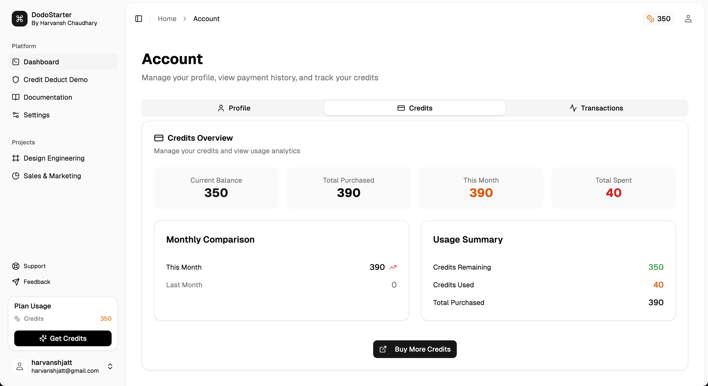

# DodoStarter Boilerplate (AS-IS)


> ⚠️ **This is not a finished product. It is an abandoned, 90% complete project.** ⚠️

This project is provided **AS-IS**. I will not be providing any support, updates, or further development.

## A Note on This Project's Status

I have made the decision to stop development on this boilerplate to focus my full energy on growing my main products: [Unrealshot.com](http://Unrealshot.com), [bringback.pro](http://bringback.pro), and [cvfolio.me](http://cvfolio.me).

Instead of letting this code die on my hard drive, I am open-sourcing it in the hope that it might be a useful starting point or learning resource for someone else.

Feel free to fork it, learn from it, or use any part of the code for your own projects.

## The Original Goal

The philosophy behind this boilerplate was to be a **brutally simple kick-starter**, not another bloated, feature-heavy framework. The goal was to solve the most tedious parts of starting a new SaaS—user authentication and payments—without forcing a mountain of opinions on the developer.

It was designed for developers who want to start building their core features in minutes, not spend their first day deleting code they don't need.

## Tech Stack

This project is built with a modern, powerful, and intentionally lean stack:

-   **Framework**: `Next.js 15` (App Router)
-   **Language**: `TypeScript`
-   **Styling**: `Tailwind CSS`
-   **UI Components**: `Shadcn/UI`
-   **Backend & Auth**: `Supabase`
-   **Payments**: `Dodopayments`

## What's Included (The 90%)

This boilerplate has a solid foundation with the following features already implemented and working:

-   ✅ **Full Next.js 15 Project Setup**: Using the App Router.
-   ✅ **User Authentication**:
    -   Supabase client is set up and ready to go.
    -   Functional signup, login, and logout flows.
-   ✅ **Protected Routes**: Middleware is in place to protect dashboard pages from unauthenticated users.
-   ✅ **Credit based One-Time Payments**:
    -   Server-side integration with the Dodopayments API.
    -   A basic example of a payment button/flow.
-   ✅ **Styling Foundation**:
    -   Tailwind CSS is fully configured.
    -   Shadcn/UI is installed and a few basic components are in use.
-   ✅ **Code Quality**: `ESLint` is configured for a consistent codebase.

### Core Features

*   **Credit System:** A complete system for managing user credits, including purchasing, spending, and tracking.
    *   **Credit Management:** Add, deduct, and check user credits.
    *   **Real-time Updates:** UI updates automatically when credit balances change.
    *   **Payment Integration:** Seamlessly purchase credits through our integrated payment system with Dodopayments.


*   **Demo Credit System:** See how credits are deducted in real-time when using tools.


### Security

*   **Rate Limiting:** Protects your application from brute-force attacks and abuse by limiting the number of requests from a single IP address. This feature is powered by `Upstash Redis`.
*   **CSRF Protection:** Built-in protection against Cross-Site Request Forgery attacks, ensuring that all requests are legitimate and secure.

### SEO

*   **Centralized SEO Configuration:** Manage all your SEO settings from a single, easy-to-use configuration file.
*   **Next.js 13+ Metadata API:** Utilizes the latest Next.js features for modern and type-safe metadata management.
*   **Structured Data (JSON-LD):** Automatically generate structured data for rich snippets in search engine results.
*   **Dynamic Sitemap & `robots.txt`:** The boilerplate automatically generates a `sitemap.xml` and `robots.txt` file for you.

### UI & UX

*   **Dynamic Breadcrumb System:** Automatically generates breadcrumb navigation based on the current page's route.
*   **Skeleton Loading System:** Provides a professional and seamless user experience with skeleton loading screens while data is being fetched.

## What's Missing (The 10%)

This is where you would need to put in work. The following features are **not** included or are incomplete:

-   ❌ No Advanced Payment Logic (e.g., recurring subscriptions etc.).
-   ❌ No Comprehensive Test Suite.
-   ❌ No Pre-built Admin Dashboard.
-   ❌ No Extensive UI Component Library.
-   ❌ No Beautiful Documentation.

## Getting Started

To get this running locally, follow these steps:

1.  **Clone the repository:**

    ```bash
    git clone [your-repo-url.git]
    ```

2.  **Set up your environment variables:**

    ```bash
    cp .env.example .env.local
    ```

    Then, fill in your `Supabase` and `Dodopayments` API keys in the `.env.local` file.

3.  **Install dependencies and run the dev server:**

    ```bash
    npm install
    npm run dev
    ```

    The app should now be running on [http://localhost:3000](http://localhost:3000).

### Account Management

The boilerplate includes comprehensive account management features:

**Credit Balance Tracking:**


**Transaction History:**


4.  **Apply the database schema:**

    The SQL migration files are located in the `utils/supabase/migrations` directory. You can apply them to your Supabase project using the Supabase CLI or by running them directly in the Supabase SQL editor.

5.  **Create a Dodopayments Product and Add it to the Database:**

    To set up payments, you need to create a product in your Dodopayments dashboard and then add its details to your Supabase database.

    1.  **Create a product in Dodopayments:** Log in to your Dodopayments account, create a new product, and copy the generated **Product ID**.
    2.  **Add the product to your database:** The project uses a `dodo_pricing_plans` table to store product information. You can add the product by:
        *   Running an `INSERT` statement in the Supabase SQL editor.
        *   Adding a new row in the Supabase UI.
        *   Creating a new migration file in `utils/supabase/migrations` (recommended).

    Here is an example `INSERT` statement:

    ```sql
    INSERT INTO dodo_pricing_plans (product_id, plan_name, price, credits_granted, is_featured)
    VALUES ('prod_xxxxxxxxxxxxxx', '100 Credits', 999, 100, false);
    ```

## Documentation

For detailed configuration guides and additional information, check out the comprehensive documentation in the `/docs` folder:

- **CREDIT_INTEGRATION_GUIDE.md** - Complete guide for integrating the credit system
- **CREDIT_SYSTEM.md** - Overview of the credit system architecture
- **CSRF_PROTECTION.md** - CSRF protection implementation details
- **SECURITY.md** - Security best practices and configurations
- **SEO_GUIDE.md** - SEO optimization and configuration guide
- **DYNAMIC_BREADCRUMB_SYSTEM.md** - Breadcrumb navigation system documentation
- **SKELETON_LOADING_SYSTEM.md** - Loading states and skeleton UI implementation

These guides provide step-by-step instructions for configuring and customizing various aspects of the project to suit your needs.

## License

This project is licensed under the **MIT License**. You are free to do whatever you want with it.